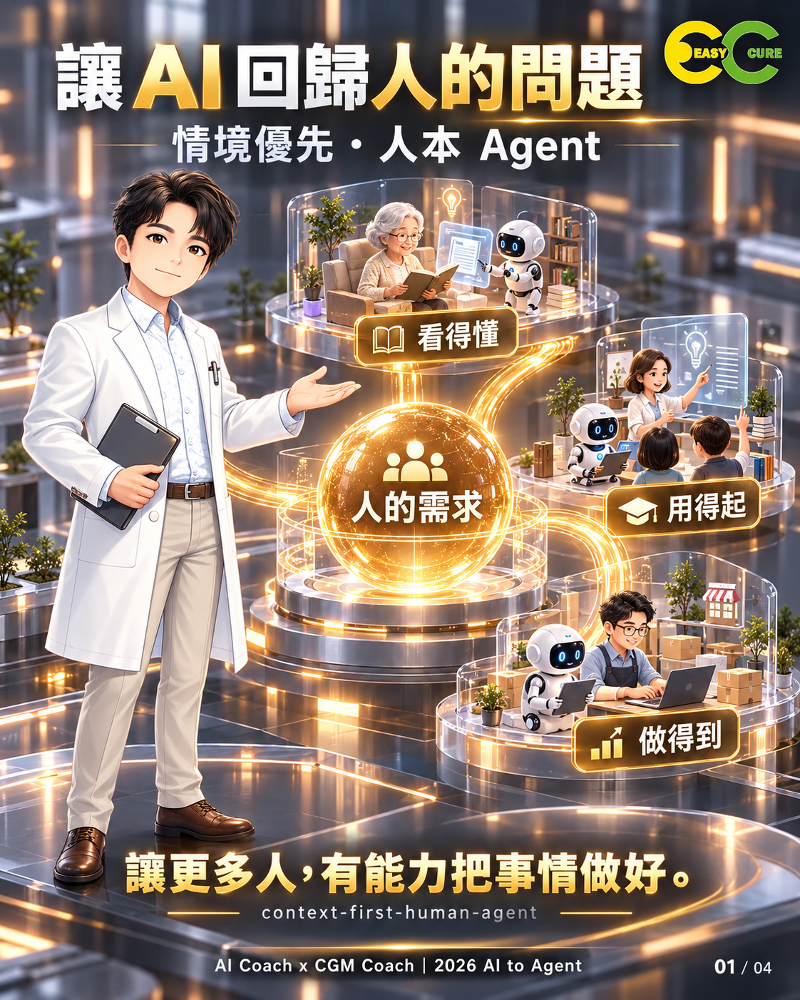
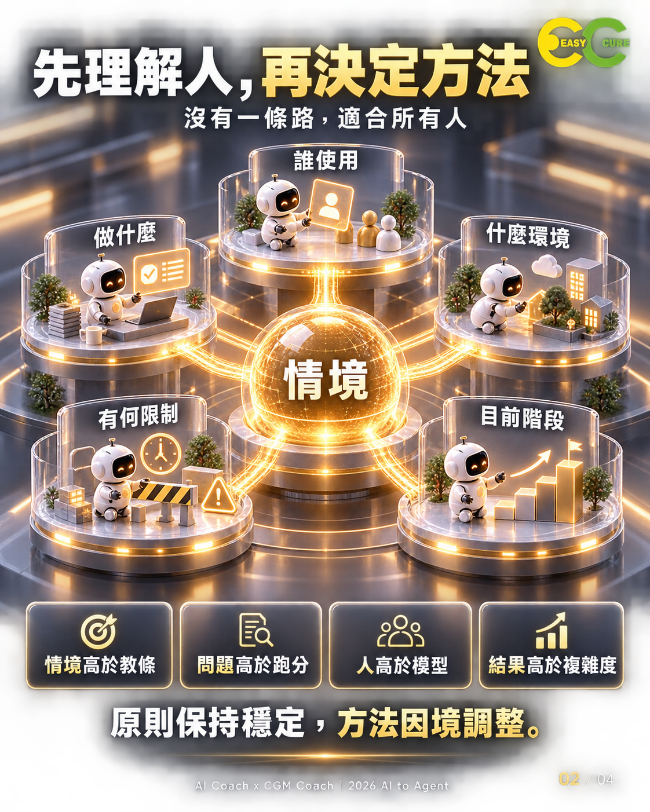
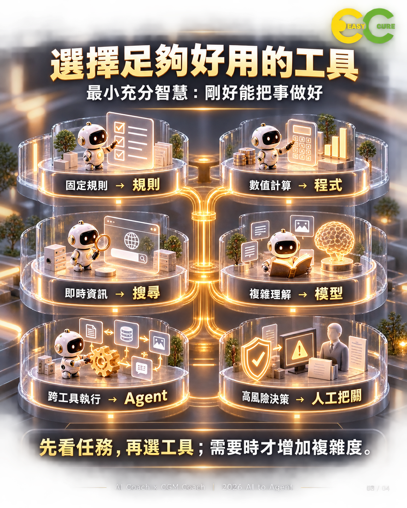
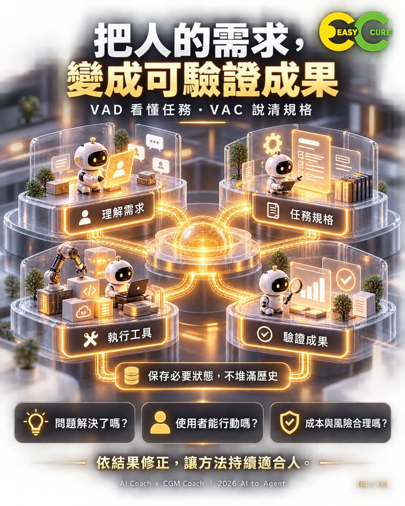

# Context-First Human Agent

**AI to Agent 上位決策治理 Skill**

> **Context over Dogma · Problems over Benchmarks · People over Models · Outcome over Complexity**

## 核心主張

世界不存在一條適用所有人的標準道路。

Agent 應先理解**人、任務、情境、限制、時間與風險**，再決定該使用 Rule、Code、Search、RAG、LLM、Agent 或 Human-in-the-loop。

這個 Skill 的目的不是讓 Agent 更會「展示聰明」，而是讓它更會：

- 找出真正問題。
- 選擇最小充分複雜度。
- 根據使用者與任務動態調整。
- 避免 Benchmark Worship、Model Worship、Agent Everywhere。
- 將 AI 能力轉換成可理解、可執行、可驗證的人類成果。

## 四大原則

1. **Context over Dogma｜情境高於教條**
2. **Problems over Benchmarks｜問題高於跑分**
3. **People over Models｜人高於模型**
4. **Outcome over Complexity｜結果高於複雜度**

## 核心哲學

> **AI 的目的，不是證明機器有多聰明，而是讓更多人有能力把事情做好。**

---

## 視覺圖卡

### 01 / 04｜讓 AI 回歸人的真實問題



**People over Models。**

AI 的價值不在於模型多聰明，而在於能不能讓更多人：

- **看得懂**
- **用得起**
- **做得到**

中心的「人的需求」代表真正的最佳化目標是 **Human Outcome**。

---

### 02 / 04｜先理解人，再決定方法



**Context over Dogma。**

先判斷：

- 誰使用
- 做什麼
- 什麼環境
- 有何限制
- 目前階段

原則保持穩定，方法因境調整。

---

### 03 / 04｜選擇足夠好用的工具



**Minimum Sufficient Intelligence。**

- 固定規則 → Rule
- 數值計算 → Code
- 即時資訊 → Search
- 複雜推理 → LLM
- 跨工具執行 → Agent
- 高風險決策 → Human-in-the-loop

圖卡是教學收斂版；完整路由另包含 RAG、Structured Processing、Choice、Score、Extract。

---

### 04 / 04｜把人的需求，變成可驗證成果



**VAD / VAC → Execution → Verification。**

```text
理解需求
 ↓
VAD：讓人看懂任務
 ↓
VAC：形成可執行、可驗證的任務契約
 ↓
執行工具
 ↓
驗證成果
```

同時遵守：

```text
History ≠ State
Events → Semantic State → Relevant Context → Decision
```

最後驗收：

- 問題解決了嗎？
- 使用者能行動嗎？
- 成本與風險合理嗎？

---

## 一致性檢查

四張圖卡與 `SKILL.md` 核心邏輯一致：

```text
People
 ↓
Context
 ↓
Routing
 ↓
VAD / VAC
 ↓
Execution
 ↓
Verified Outcome
```

### 已統一的正式用語

- 「複雜理解 → 模型」在正式文件中統一為 **「複雜推理 → LLM」**。
- 「VAD 看懂任務」對應正式定義：**人類可理解的任務視覺化**。
- 「VAC 說清規格」對應正式定義：**機器可執行、可驗證的任務契約**。
- 圖卡是教學精簡版；完整 Task Routing 以 `SKILL.md` 為準。

---

## 與 AI to Agent 的關係

```text
Human Need
 ↓
Context
 ↓
VAD
 ↓
VAC
 ↓
Task Router
 ↓
Rule / Code / Search / Model / Agent
 ↓
Verify
 ↓
Human Outcome
```

## 與 Radical Hacker Persona 的關係

- `context-first-human-agent`：決定**怎麼思考與選路徑**。
- `radical-hacker-persona`：決定**用什麼視角挑戰假設與架構**。

Context-First 位於更上層，避免「為反骨而反骨」。

## 專案結構

```text
ai-to-agent-custom-skill/
├─ README.md
├─ SKILL.md
├─ CHANGELOG.md
├─ VISUAL-GUIDE.md
└─ assets/
   └─ cards/
      ├─ 01-human-needs.png
      ├─ 02-context-first.png
      ├─ 03-minimum-sufficient-intelligence.png
      └─ 04-vad-vac-verified-outcome.png
```

## Version

**v1.1.0 — 2026-09-25**

**AI Coach 益力康陳董 x CGM Coach 血糖教練 | 2026 AI to Agent**
